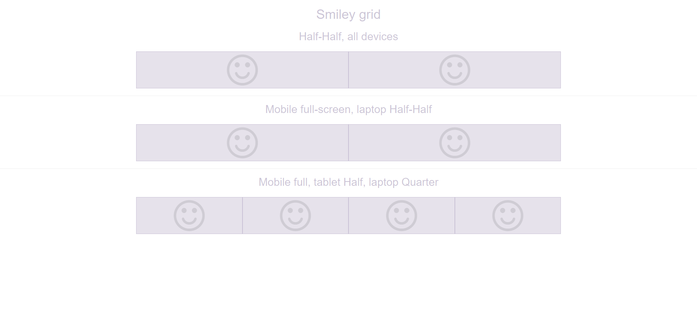
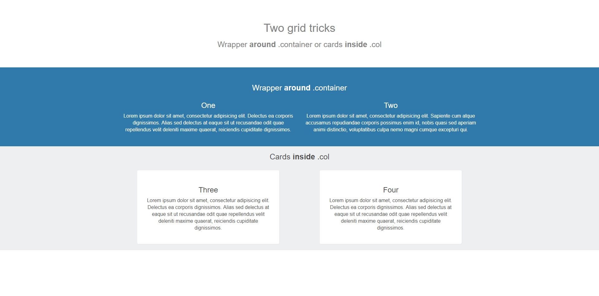
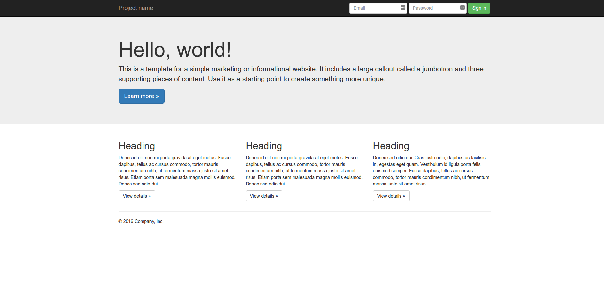

# Introduction

Pour créer une page responsive les media-queries c'est bien mais c'est long à mettre en place. Heureusement,
il existe des outils pour vous simplifier la vie ! Comme par exemple  le framework [Twitter Bootstrap](http://getbootstrap.com/)

# Objectif

* Installer Twitter Bootstrap dans son projet
* Rendre une page responsive grâce à Twitter Bootstrap
* Comprendre le système de *grid*
* Utiliser les composants *front* les plus répandus proposer par bootstrap (responsive menu, glyphicons, buttons, etc.)

# Playground

Vous devez reproduire les templates qui se trouvent dans le dossier templates. Une page html par template. N'hésitez pas à utiliser abondamment la documentation bootstrap.

Note :
Pour inclure bootstrap dans vos pages, privéligiez le CDN.

# Smiley Grid

Pour faire le petit smiley vous utiliserez la police d'icône [Font Awesome](https://fontawesome.com/get-started/web-fonts-with-css).

Pour se faire :

* Inclure la font dans votre html entre les balises `<head>...</head>` :
```html
<link rel="stylesheet" href="https://use.fontawesome.com/releases/v5.0.13/css/all.css" integrity="sha384-DNOHZ68U8hZfKXOrtjWvjxusGo9WQnrNx2sqG0tfsghAvtVlRW3tvkXWZh58N9jp" crossorigin="anonymous">
```
* Code du smiley à placer à l'endroit où vous voulez : 
```html 
<i class="far fa-smile"></i>
```



# Grid with wrapper



# Full page



# Ressources

* [Qu'est ce que c'est bootstrap ?](https://www.quackit.com/bootstrap/bootstrap_4/tutorial/what_is_bootstrap.cfm)
* [Grid system](https://www.quackit.com/bootstrap/bootstrap_4/tutorial/bootstrap_grid_system.cfm)
* [Prise en main](https://www.quackit.com/bootstrap/bootstrap_4/tutorial/)
* [Documentation officielle](http://getbootstrap.com/docs/4.1/getting-started/introduction/)
